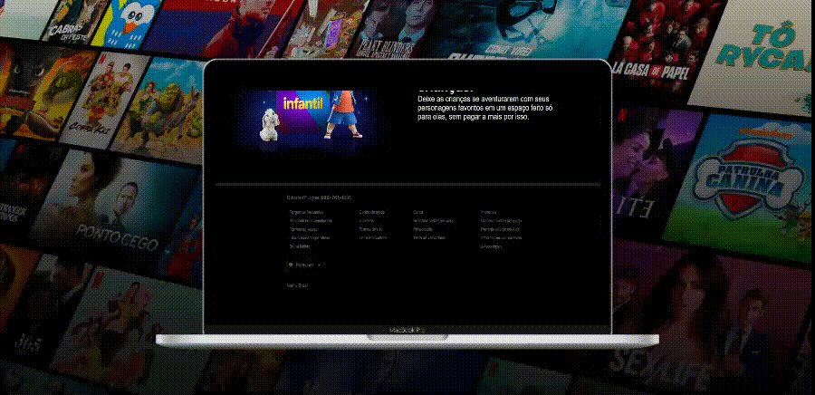
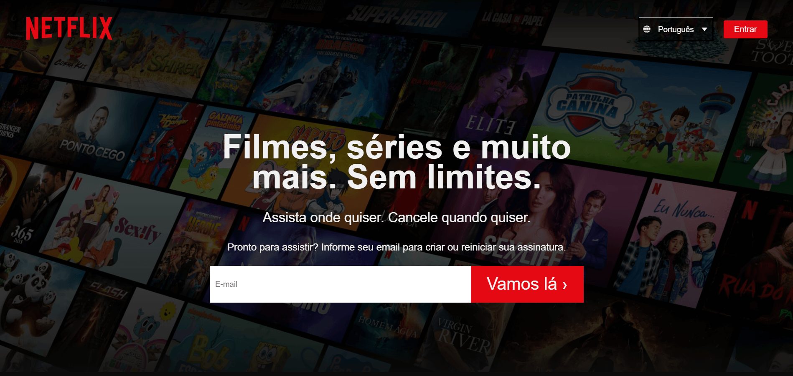

 
  

<a href="https://td-netflix-clone.surge.sh/">Demo</a>

<h2 align="center"><strong>Netflix Clone</strong></h2>

  

  

  

 <h4 align="center">
	🚧 <strong>STATUS:</strong> Responsividade: Em construção...  🚧
</h4>

  <a href="#camera-screenshot">Screenshot</a> &#xa0; | &#xa0;<a href="#dart-sobre">Sobre</a> &#xa0;  | &#xa0;
  <a href="#rocket-tecnologias">Tecnologias</a> &#xa0; | &#xa0;
  <a href="#memo-licença">Licença</a> &#xa0; | &#xa0;
  <a href="https://github.com/thiilins" target="_blank">Autor</a>

 

## :camera: Screenshot

 

  

## :dart: Sobre

 

Clone da landing page da NETFLIX com a finalidade de estudar/praticar HTML5 e CSS
 

## :rocket: Tecnologias

 

As seguintes ferramentas foram usadas na construção do projeto:

- HTML
- CSS
   

## :memo: Licença

 

Este projeto está sob licença MIT.
 

&#xa0;

Feito com :heart: por <a href="https://github.com/thiilins" target="_blank">Thiago Lins</a>

<a href="#top">(Voltar para o topo)</a>

